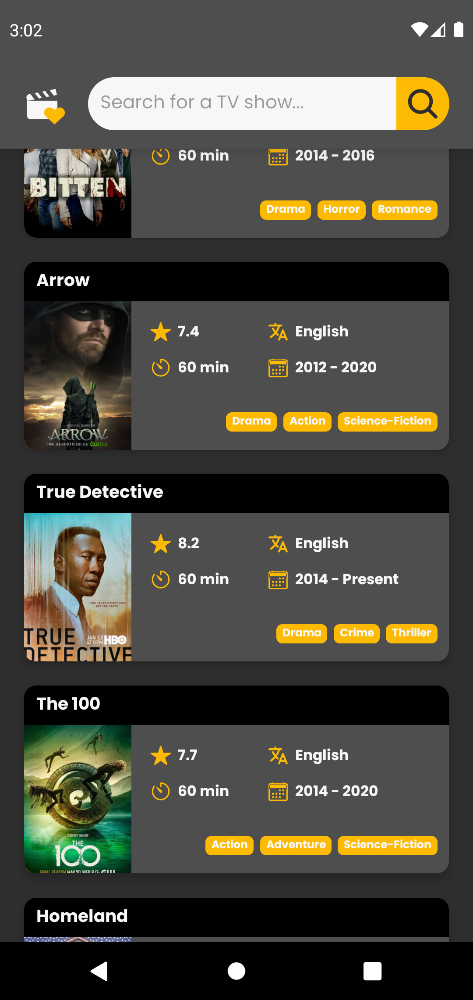
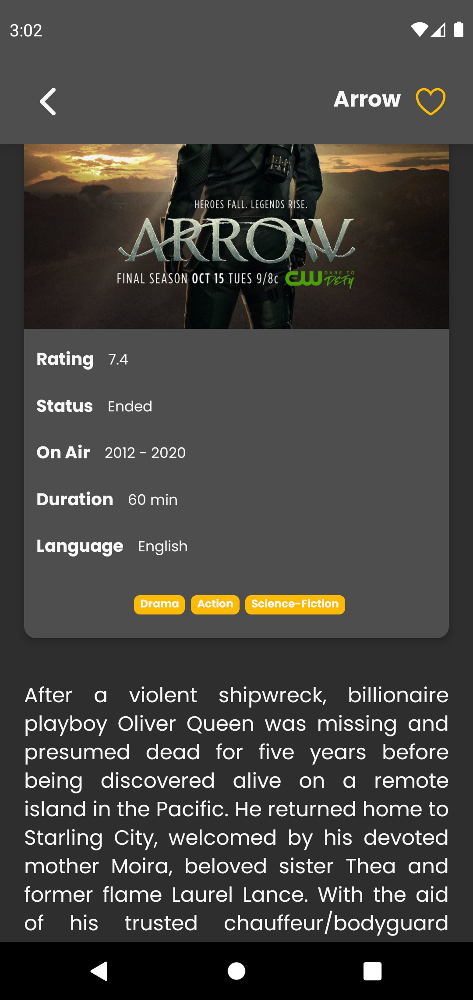
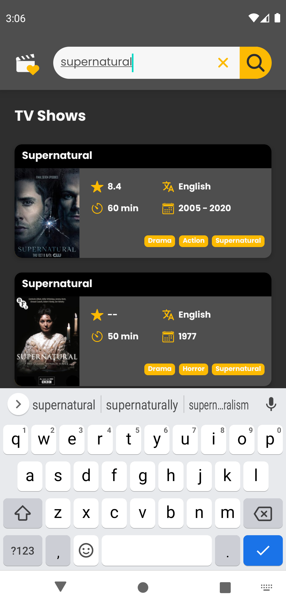
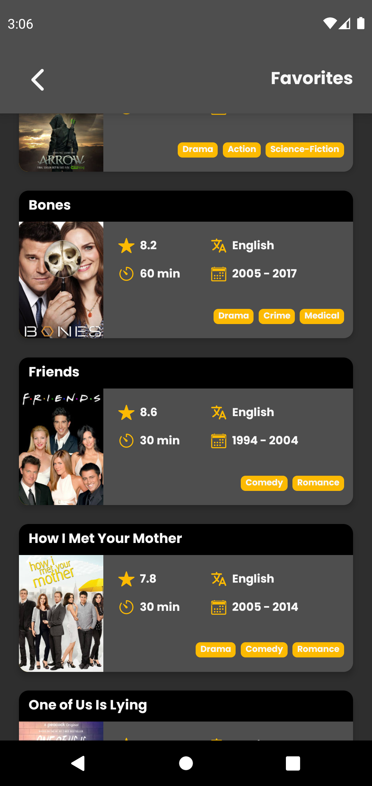

# 📽️ FavoriTV 

   

## 💡 Tecnologias

- API Rest
- Async Storage

## 📝 Projeto
FavoriTV é um app em que o usuário pode visualizar uma lista com inúmeras séries de TV, ver os detalhes, buscar por alguma específica e favoritar as que mais gosta.

O aplicativo consome dados da TVmaze API.
